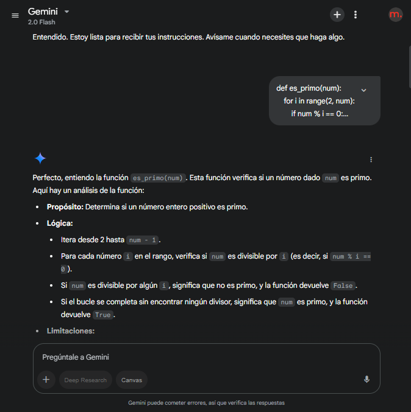
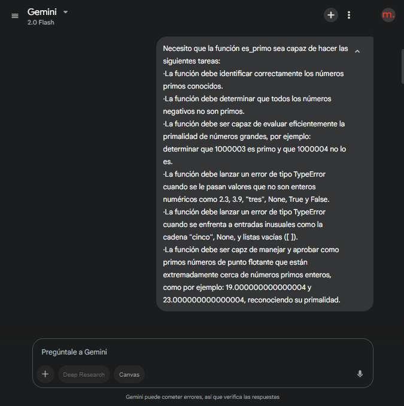
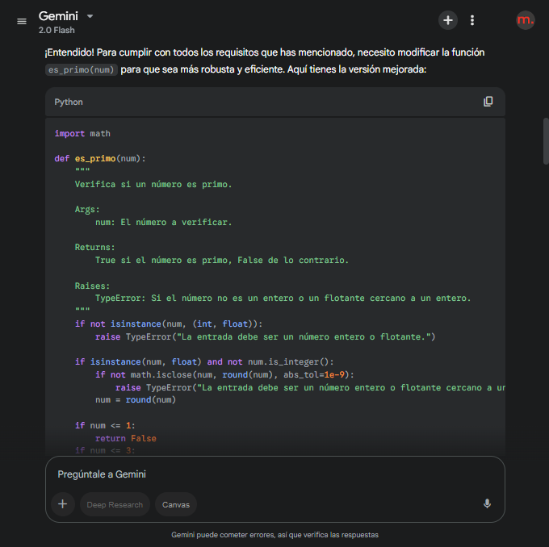
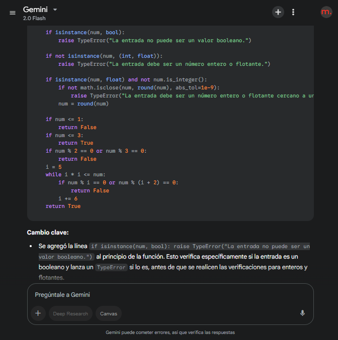
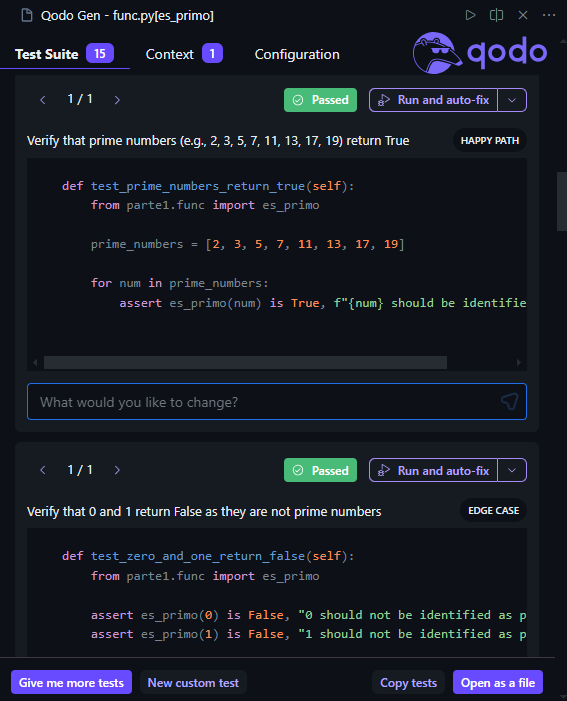
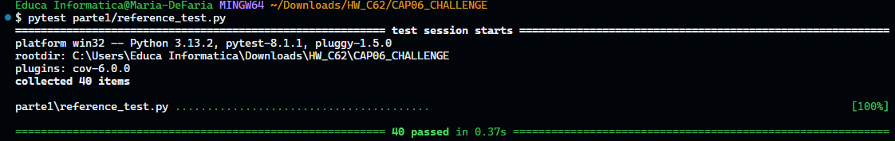
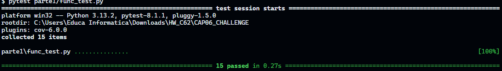
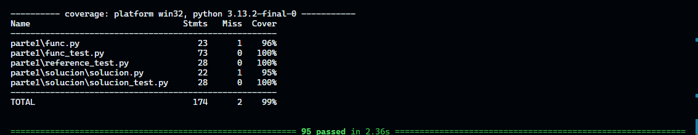

# Resolución del Challenge de testing con AI

## Función es primo

Primero le pedí a Gemini que me explicara el funcionamiento de la función inicial

Luego le dí una lista de especificaciones que debía cumplir la función

Su primer intento fue:

Al ver que no cumplía con una de las especificaciones (No lanzaba el TypeError cuando el dato recibido era un booleano) le pedí que me diera una solución, y me dio la siguiente función:

## Realización de test

Directamente desde el archivo con el chatbot de Qodo realicé los test, modificando ciertas partes del código para que cumplieran con las especificaciones. Y agregando algunas pruebas más.

## Tests

Al correr los tests, todos pasaron correctamente.

Tanto los tests de reference_test.py

Como los tests de func_test.py

## Coverage

